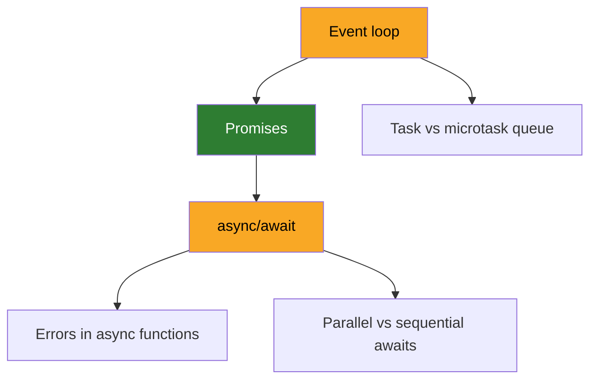

# Example: a course after one session

One worked course, for a learner who said "I want to understand async JavaScript properly".
Copy the shape, never the content.
What makes it a course and not a syllabus is that every state on the map is backed by something the learner said out loud.

---

## `COURSE.md`

```markdown
# Concurrency in JavaScript

**Why:** debug the hangs in the payments backend without guessing.
**How to explain it to me:** example first, theory after. No restaurant metaphors.
**Out of scope:** workers, streams.
```

Note what the goal is not.
"Understand async properly" was the opening answer, and it was pushed until it named a thing the learner will be able to do.
The out of scope line is doing real work: it is what keeps workers and streams from turning into nodes nobody needs.

---

## `MAP.md`

````markdown
## Map



## Evidence
- **Event loop**: could not say why a `.then()` runs before a `setTimeout(0)` queued earlier. Guessed "timers are faster".
- **Promises**: explained unprompted that chaining returns a new promise, and that a `.then()` handler's return value becomes the next one's input.
- **async/await**: said `await` "pauses the thread". Corrected in session 1, not yet re-probed.

## Sources
- [Jake Archibald, "In The Loop"](https://www.youtube.com/watch?v=cCOL7MC4Pl0): the real ordering of the two queues.
- [MDN, Using promises](https://developer.mozilla.org/en-US/docs/Web/JavaScript/Guide/Using_promises): reference for chaining and error propagation.
````

This map shows the thing a ladder cannot.
The learner is **solid on promises but weak on the event loop**, which sits above them in the graph.
A triage that walked a straight line from easy to hard would have stopped at the first miss and never found out that promises were already held.

The frontier here is `Event loop`, not `async/await`.
Both are weak, but the event loop has no unheld parent, so it is the one that can be taught today.
Nothing in the file states this, because it reads straight off the graph.

`C`, `E` and `F` carry no class.
That is what "not seen yet" looks like, and it is why a fresh map is nearly all bare nodes.

---

## `lessons/0001-event-loop.md`

```markdown
# Event loop

You have a `setTimeout(fn, 0)` and a `Promise.resolve().then(fn)` queued in that order.
The `.then()` runs first. Every time, on every engine.

That is because there are two queues, not one, and they are not read at the same rate.
The microtask queue (promises) is drained **completely** after the current script finishes.
Only then does the loop take **one** task off the macrotask queue (timers, I/O, events) and run it.
Then it drains the microtasks again.

So a promise never waits behind a timer, and a chain of a thousand `.then()` calls will
starve a `setTimeout(0)` until the whole chain is done. That starvation is the bug
you have been seeing in the payments backend.

## Visual
[The two queues draining, one tick at a time](0001-event-loop.html)

## Source
[Jake Archibald, "In The Loop"](https://www.youtube.com/watch?v=cCOL7MC4Pl0): the queue ordering, shown live at 8:30.

## Check
**Given a `setTimeout(0)`, then a `.then()`, then a second `setTimeout(0)`, all queued in that order from the same script: what is the output order, and why?**
Learner answered: then, timeout, timeout. "Microtasks all drain first, then one timer at a time, and there are no new microtasks between the two timers."
Correct, and the reason was right, which is what mattered. The prediction was on a case not covered in the explanation.

## Result
Event loop: solid. Predicted an unseen case and gave the mechanism, not the answer.
```

The check is probe 2, prediction, and it was built from a case the explanation did not walk through.
Had it re-asked the exact example from the text, it would have measured reading, not understanding.

---

## Why this node earned a page

`lessons/0001-event-loop.html` exists because the node is **something that moves**, and the prose above has to
say in three paragraphs what one tick of the loop does in an instant.
Six steps, forward and back: script running, microtasks draining to empty, one task taken, microtasks draining again.
The learner presses Forward and watches the timer sit there while the promises go.

Two things the page is not.
It does not repeat the explanation with better type, and it does not ask the question.
The check stayed in the Markdown, so what moved `Event loop` to `solid` is still a sentence the learner produced.

`Promises` would not have earned a page.
Chaining is a rule about return values, and a rule is exactly the thing prose is already good at.

---

## What the same map looks like after this session

Two things move and nothing else does:

- **The graph**: `A` moves from `weak` to `solid`. `class A,D weak` becomes `class D weak`, and `class B solid` becomes `class A,B solid`.
- **Evidence**: the `Event loop` line is replaced by what the learner produced today. The old line goes, because it recorded a state that is no longer true.

`COURSE.md` is not touched.
It only moves when the goal moves, and debugging the payments backend is still the goal.

The next session opens on `Task vs microtask queue` or on `async/await`, both now unblocked.
`async/await` wins, because it already carries a recorded misconception and a wrong belief left standing spreads to `E` and `F` underneath it.

---

## The same course for a Spanish-speaking learner

The shape does not move.
The directory is still `concurrency-in-javascript/`, the files are still `COURSE.md`, `MAP.md` and `lessons/`, and the headings are still `## Map`, `## Evidence` and `## Sources`.

Only what the learner reads changes language:

````markdown
## Evidence
- **Event loop**: no supo decir por qué un `.then()` corre antes que un `setTimeout(0)` encolado antes. Supuso que "los timers son más rápidos".
````

The node labels stay `Event loop` and `Promises`.
Those are the words this learner will meet in every article, every error message and every colleague's question, so translating them would teach a vocabulary that exists nowhere outside the course.
